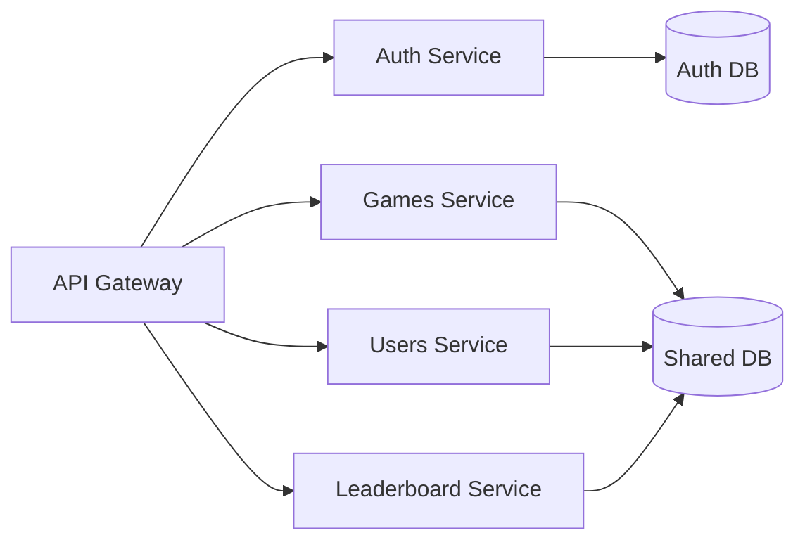

# GameHub API - TypeScript Monorepo Documentation

## Backend Framework Analysis

1. Express.js

   Pros:

    - Mature & Stable: Battle-tested with a massive ecosystem
    - Minimalist: Unopinionated, gives you full control
    - Performance: Lightweight with minimal overhead
    - Flexibility: Can structure the code however you like
    - Ecosystem: Largest NPM package ecosystem
    - Learning Curve: Easy to onboard new developers

   Cons:

    - Boilerplate: Need to set up many things manually
    - Architecture: No enforced structure (can be a pro or con)
    - TypeScript Support: Additional setup required
    - Scalability: Requires manual implementation of patterns

2. NestJS

   Pros:

    - Structured: Opinionated architecture with clear patterns
    - TypeScript First: Excellent TypeScript support out of the box
    - Modular: Perfect for microservices and monorepos
    - Built-in Features: Authentication, validation, WebSockets, etc.
    - Dependency Injection: Makes testing and maintenance easier
    - Documentation: Excellent and comprehensive

   Cons:

    - Learning Curve: Steeper than Express
    - Boilerplate: Can feel heavy for simple services
    - Performance: Slightly more overhead than Express
    - Less Flexibility: More opinionated structure

3. Deno

   Pros:

    - Modern Runtime: Built with TypeScript in mind
    - Security: Secure by default (explicit permissions)
    - Built-in Tools: Testing, formatting, and linting included
    - ES Modules: Native support for ES modules
    - Fresh Framework: Modern alternative to Express in Deno

   Cons:

    - Ecosystem: Smaller community and fewer packages
    - Maturity: Newer runtime, fewer production use cases
    - Compatibility: May need polyfills for some Node.js packages
    - Learning Curve: Different from Node.js ecosystem

### Recommendation: NestJS

For your gaming platform, I recommend NestJS for these reasons:

Monorepo Support: Excellent built-in support for monorepos with Nx or Yarn workspaces
Modularity: Perfect for a multi-game platform where each game might need its own modules
Type Safety: Strong TypeScript support ensures better code quality across teams
Scalability: Built-in support for microservices and WebSockets
Maintainability: Enforced structure keeps the codebase consistent
Ecosystem: Growing rapidly with good support for gaming-related features

### Implementation Example

Here's how you might structure the backend:

```
/packages
    /core
        /common           # Shared utilities
        /database         # Database connections
        /auth             # Authentication
        /game-engine      # Shared game logic
    /games
        /fps-game         # FPS game backend
        /puzzle-game      # Puzzle game backend
        /strategy-game    # Strategy game backend
    /gateway           # API Gateway
    /matchmaking       # Matchmaking service
    /leaderboards      # Leaderboard service
```

### Migration Path

If you're concerned about NestJS's learning curve:

1. Start with Express for MVP
2. Gradually migrate to NestJS module by module
3. Use the nestjs/platform-express adapter to run Express under NestJS

### When to Consider Alternatives

- Choose Express if:
    - You need maximum performance
    - You prefer minimal abstraction
    - Your team is already proficient with Express
- Choose Deno if:
    - You're starting a greenfield project
    - You want modern JavaScript/TypeScript features
    - You value security and built-in tooling

### Final Note

For a gaming platform with multiple games in a monorepo, the structure and maintainability benefits of NestJS will
likely save you time and effort in the long run, especially as your platform grows. The initial learning curve is worth
the long-term benefits of a well-structured, type-safe backend.

## Core Architecture

- **Runtime**: Node.js (TypeScript)
- **Framework**: NestJS (to maintain similar structure to Spring Boot)
- **Database**: PostgreSQL with TypeORM/Prisma
- **Authentication**: JWT + Firebase integration
- **Deployment**: Containerized (Docker) with Kubernetes/Cloud Run
- **API Style**: RESTful + GraphQL hybrid

## Authentication & Security

### Current Implementation

- JWT-based authentication
- Firebase ID token exchange
- Role-based access control (RBAC)
- Refresh token rotation
- Rate limiting (in-memory or Redis-backed)
- Security headers (CSP, HSTS, etc.)
- CORS configuration

### Planned Enhancements

- OAuth 2.0/OIDC support
- API key authentication for services
- Enhanced rate limiting strategies

## Core Features

### 1. User Management

- User registration & profile management
- Role-based permissions
- Admin user seeding
- Session management

### 2. Games Service

- Game metadata management
- Score submission and validation
- Leaderboards
- Game statistics

### 3. Projects Service

- Portfolio project listings
- Project categorization and filtering
- Media management for projects

### 4. Feature Flags

- Runtime feature toggles
- User segmentation
- Gradual rollouts
- Admin UI for management

## API Endpoints

### Public Endpoints

- `GET /healthz` - Health check
- `GET /api/meta` - Application metadata
- `GET /api/projects` - List projects (paginated)
- `GET /api/featured` - Featured games
- `GET /api/scores` - Public scoreboards

### Protected Endpoints

- `POST /api/auth/*` - Authentication endpoints
- `GET /api/users/me` - Current user profile
- `POST /api/scores` - Submit score
- `GET /api/admin/*` - Admin endpoints

### GraphQL

- Single `/graphql` endpoint
- Type-safe schema
- Authentication via JWT

## Data Layer

### Database Schema

- Users & authentication
- Game sessions & scores
- Projects & media
- Feature flags

### Caching

- Redis for:
    - Session storage
    - Rate limiting
    - Leaderboard caching
    - Feature flags

## DevOps & Infrastructure

### CI/CD

- Automated testing
- Container builds
- Deployment pipelines
- Environment management

### Monitoring

- Structured logging
- Metrics collection
- Distributed tracing
- Alerting

### Security

- Secret management
- Security headers
- Rate limiting
- Request validation

## Frontend Integration

### API Contracts

- TypeScript interfaces
- OpenAPI/Swagger docs
- Error handling patterns
- Pagination standards

### Authentication Flow

1. Frontend authenticates with Firebase
2. Exchanges Firebase token for JWT
3. Uses JWT for subsequent requests
4. Handles token refresh

## Future Roadmap

### Short-term

1. Complete migration to TypeScript
2. Implement remaining core features
3. Set up monitoring

### Mid-term

1. Real-time features
2. Enhanced analytics
3. Admin dashboard

### Long-term

1. Microservices architecture
2. Multi-region support
3. Advanced game features

## Development Setup

### Prerequisites

- Node.js 18+
- PostgreSQL 15+
- Docker
- pnpm (recommended)

### Getting Started

```bash
# Install dependencies
pnpm install

# Setup environment
cp .env.example .env

# Start services
docker-compose up -d

# Run migrations
pnpm db:migrate

# Start dev server
pnpm start:dev
```

## Project Structure

```
gamehub-ts/
├── apps/
│   ├── api/                    # Main API application
│   │   ├── src/
│   │   │   ├── auth/           # Authentication logic
│   │   │   ├── common/         # Shared utilities
│   │   │   ├── config/         # Configuration
│   │   │   ├── games/          # Games module
│   │   │   ├── projects/       # Projects module
│   │   │   ├── scores/         # Scores module
│   │   │   ├── users/          # Users module
│   │   │   ├── app.module.ts   # Root module
│   │   │   └── main.ts         # Application entry point
│   │   └── test/               # API tests
│   │
│   └── admin/                  # Admin dashboard (React/Next.js)
│       ├── public/
│       ├── src/
│       │   ├── components/     # Shared components
│       │   ├── pages/          # Next.js pages
│       │   └── styles/         # Global styles
│       └── test/
│
├── libs/
│   ├── shared/                 # Shared utilities
│   │   ├── src/
│   │   │   ├── constants/     # Shared constants
│   │   │   ├── decorators/    # Custom decorators
│   │   │   ├── dtos/          # Shared DTOs
│   │   │   ├── filters/       # Exception filters
│   │   │   ├── guards/        # Auth guards
│   │   │   ├── interfaces/    # Shared interfaces
│   │   │   └── utils/         # Utility functions
│   │   └── test/
│   │
│   ├── database/              # Database module
│   │   ├── src/
│   │   │   ├── entities/     # TypeORM entities
│   │   │   ├── migrations/   # Database migrations
│   │   │   └── services/     # Database services
│   │   └── test/
│   │
│   └── config/                # Configuration module
│       ├── src/
│       │   ├── auth/         # Auth config
│       │   ├── cache/        # Cache config
│       │   └── database/     # DB config
│       └── test/
│
├── .github/                   # GitHub workflows
│   ├── workflows/
│   │   ├── ci.yml
│   │   └── cd.yml
│   └── dependabot.yml
│
├── docker/                    # Docker configurations
│   ├── dev/
│   ├── prod/
│   └── test/
│
├── scripts/                   # Utility scripts
├── .env.example              # Environment template
├── .eslintrc.js              # ESLint config
├── .prettierrc               # Prettier config
├── nx.json                   # Nx workspace config
├── package.json              # Root package.json
└── tsconfig.base.json        # Base TypeScript config
```

## Core Features Implementation

### 1. Authentication System

**Structure:**

```
libs/auth/
├── src/
│   ├── decorators/           # @CurrentUser(), @Public()
│   ├── guards/               # JwtAuthGuard, RolesGuard
│   ├── strategies/           # JwtStrategy, FirebaseStrategy
│   ├── auth.service.ts       # Core auth logic
│   ├── auth.module.ts        # Auth module definition
│   └── interfaces/           # Auth-related interfaces
└── test/
```

### 2. Games Module

**Structure:**

```
apps/api/src/games/
├── dto/
│   ├── create-game.dto.ts
│   └── update-game.dto.ts
├── entities/
│   └── game.entity.ts
├── games.controller.ts
├── games.module.ts
└── games.service.ts
```

### 3. API Documentation

**Structure:**

```
apps/api/src/
├── docs/
│   ├── swagger/             # Swagger decorators
│   ├── api-spec.ts          # OpenAPI spec
│   └── swagger-ui/          # Custom Swagger UI assets
└── main.ts                  # Swagger setup
```

## Development Workflow

### Prerequisites

- Node.js 18+
- pnpm 7+
- Docker & Docker Compose
- PostgreSQL 15+

### Setup

```bash
# Install dependencies
pnpm install

# Copy environment files
cp .env.example .env

# Start development services
docker-compose -f docker-compose.dev.yml up -d

# Run database migrations
pnpm db:migrate

# Start development servers
pnpm dev
```

## Testing Strategy

### Unit Tests

```bash
# Run all unit tests
pnpm test

# Run specific test file
pnpm test apps/api/src/auth/auth.service.spec.ts
```

### E2E Tests

```bash
# Start test services
docker-compose -f docker-compose.test.yml up -d

# Run e2e tests
pnpm test:e2e
```

## Deployment

### Cloud Run Deployment

```yaml
# .github/workflows/cd.yml
name: Deploy to Cloud Run

on:
  push:
    branches: [ main ]

jobs:
  deploy:
    runs-on: ubuntu-latest
    steps:
      - uses: actions/checkout@v3
      - uses: google-github-actions/setup-gcloud@v1
      - run: gcloud run deploy gamehub-api --source . --region us-central1
        env:
          CLOUDSDK_CORE_PROJECT: ${{ secrets.GCP_PROJECT_ID }}
          CLOUDSDK_COMPUTE_REGION: us-central1
```

## Monitoring & Observability

### Logging Setup

```typescript
// apps/api/src/main.ts
import {NestFactory} from '@nestjs/core';
import {Logger} from 'nestjs-pino';

async function bootstrap() {
    const app = await NestFactory.create(AppModule, {
        bufferLogs: true,
    });

    app.useLogger(app.get(Logger));
    // ...
}
```

## Future Considerations

### Microservices Architecture



### Performance Optimizations

- Implement Redis caching layer
- Add database read replicas
- Implement GraphQL DataLoader
- Add response compression
- Set up CDN for static assets

## Contributing

1. Create a feature branch: `git checkout -b feature/your-feature`
2. Commit changes: `git commit -m 'Add some feature'`
3. Push to branch: `git push origin feature/your-feature`
4. Open a pull request

## License

MIT
